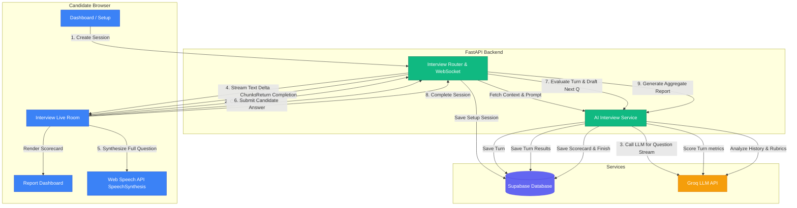

# AI Verbal Interview Workflow System

This document outlines the step-by-step architecture and communication flows for the AI Verbal Interview Simulator, mapping how the **Frontend**, **Backend (FastAPI)**, **Supabase DB**, and **Groq LLM (LLama-3)** services interact.

---

## 1. High-Level Architecture Flow

---

## 2. Step-by-Step Execution Sequence

### Phase A: Setup & Customization
1. **Dashboard Initialization**: The student selects a mode (**JD-Focused** or **Custom**), position, experience level, difficulty, and preferred voice accent in the UI dashboard.
2. **Session Creation**: The frontend sends a `POST /api/ai-interviews` payload. The backend creates a new entry in `ai_interview_sessions` with status `'setup'` and returns the session details.

### Phase B: Launch & Opening Greeting
3. **Entering the Room**: The frontend routes to `/ai-interview/live/{session_id}`. On mount, it requests microphone/camera access.
4. **Triggering the Interview**: The room opens a persistent WebSocket connection to `ws://localhost:8000/api/ai-interviews/ws/{session_id}`.
5. **Idempotent Checking**: 
   * If the session is already `'active'` (e.g. from page reload), the backend returns the current active question.
   * If `'setup'`, the backend updates the status to `'active'`, fetches candidate context (Resume, JD, difficulty), and prompts **Groq LLM** using the **Technical HR Recruiter System Prompt** to cordially greet the candidate and ask the first warm-up question.
6. **First Question Storage**: The generated question is saved as the first record in the `ai_interview_turns` table with `sort_order = 1`.
7. **Synthesis Playback**: The backend streams the text tokens down the WebSocket channel. The frontend displays the letters on-screen in real-time. Once the stream ends, the frontend sends the full accumulated question text to the browser's native `window.speechSynthesis` API, playing it instantly without server request lag.

### Phase C: Active Turn Loop (5 Questions)
8. **Candidate Response**: The candidate speaks into their microphone. The browser's native `SpeechRecognition` listener transcribes the speech to text. The candidate can also type their answer manually.
9. **Submitting the Answer**: The frontend sends an `answer` frame via the WebSocket connection with the transcribed text.
10. **Rubric Evaluation**:
    * The backend retrieves the current active question and candidates' answer.
    * It prompts the LLM to score the answer (0-100) across a **7-point technical/behavioral rubric**: *Relevance, Accuracy, Clarity, STAR Structure, JD Alignment, Confidence, and Depth*.
    * It determines if a follow-up is needed or prompts the next new question.
    * If the question limit is not yet reached, it streams the next question text to the frontend.
11. **Turn Update**: The backend inserts the evaluated details (scores, mistakes, feedback) and saves the next question in the `ai_interview_turns` table.

### Phase D: Concluding & Scorecard Aggregation
12. **Triggering Completion**: Once the 5-question limit is met (or the candidate ends it early), the room calls `POST /api/ai-interviews/{session_id}/complete`.
13. **Final Aggregation**:
    * The backend updates the session status to `'completed'`.
    * It collects all turn transcripts and rubric scores from the database.
    * It prompts Groq to analyze the entire transcript history, generating:
      * An aggregated overall score.
      * Primary strengths and weaknesses.
      * Customized study recommendations pointing to specific topics in the practice test platform.
    * Updates the database with the aggregated scorecard metrics.
14. **Redirecting to Report**: The room routes the candidate to `/ai-interview/report/{session_id}` where the React interface fetches and renders the visual metrics charts.
