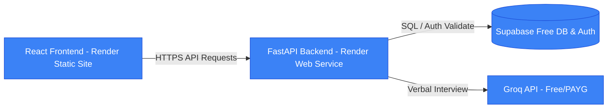
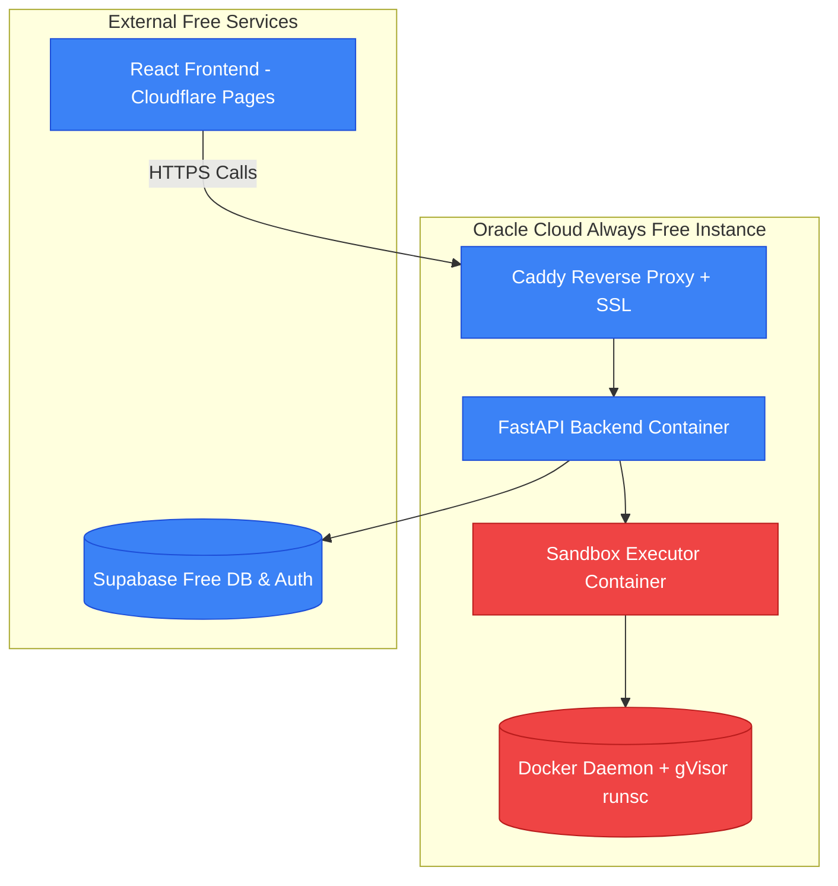

# Free Forever Deployment Strategy

This document outlines how to deploy the entire AiValytics Unified Platform at **$0.00 / month forever** using modern cloud free tiers.

---

## 🛠️ Option 1: Managed Serverless Free Tiers (Render Blueprint - Easiest & Zero Maintenance)

This architecture uses Render's **Blueprint IaC (Infrastructure as Code)** to deploy and link the entire monorepo automatically. It requires zero server configuration.



### Free Tier Limitations on Render
> [!IMPORTANT]
> - **Code Compiler Sandbox Inactive**: Free serverless container instances on Render do not support nested Docker socket access (Docker-in-Docker). Consequently, the coding compilation verifies in the Code Arena will return "Secure execution service is unavailable" (which is the fallback message). The MCQs, AI Verbal Interviews, student dashboard, and admin CMS will function $100\%$ perfectly.
> - **Inactivity Sleep**: Free-tier web services on Render sleep after 15 minutes of inactivity. When a student visits the app after it sleeps, the first request will take about 50 seconds to spin up the backend container again.

---

### Step-by-Step Render Deployment Guide

#### Step A. Prep Database & AI API Keys
1. **Supabase**: Set up a free project at [supabase.com](https://supabase.com/). Copy your `Database Connection URL`, client `Anon Key`, and service role `Service Role Key`.
2. **Groq**: Register an API key at [console.groq.com](https://console.groq.com/).

#### Step B. Push Project to GitHub
Ensure the [render.yaml](./render.yaml) file is committed to the root of your GitHub repository.

#### Step C. Connect to Render and Deploy Blueprints
1. Go to the [Render Dashboard](https://dashboard.render.com/) and click **New +** $\rightarrow$ Select **Blueprint**.
2. Connect your GitHub repository.
3. Render will auto-detect the `render.yaml` specification and list the two components to create:
   - `aivalytics-backend` (Docker Web Service)
   - `aivalytics-frontend` (Static Site)
4. Under **Global Variables** or **Service Env Variables**, Render will request you to fill in the parameters marked `sync: false` in the blueprint. Fill them in:
   - `SUPABASE_URL`: Your Supabase Project HTTP URL.
   - `SUPABASE_SERVICE_ROLE_KEY`: Your Supabase Service Role secret key.
   - `DATABASE_URL`: Your transaction pooler database connection string.
   - `GROQ_API_KEY`: Your Groq API key.
   - `VITE_SUPABASE_URL`: Same as `SUPABASE_URL`.
   - `VITE_SUPABASE_ANON_KEY`: Your Supabase client anonymous public key.
5. Click **Apply**. Render will automatically build the backend Dockerfile and bundle the static React frontend client, linking them dynamically via the backend service URL.

---


## 🏗️ Option 2: Oracle Cloud Always Free VM (Full Docker Stack with Compiler)

If you want the **entire project** (including the Code Arena compilation sandbox running secure gVisor docker containers) to run for **$0.00 / month forever**, you can deploy it on an Oracle Cloud Always Free compute instance.



### What Oracle Cloud Offers for Free Forever:
- **Compute Options**:
  - Up to **4 ARM Ampere A1 cores** and **24 GB RAM** (can be configured as a single massive VM or split into multiple VMs).
  - Or **2 AMD micro instances** (1 GB RAM each).
- **Storage**: 200 GB of free block storage volume.

### OCI Signup Requirements & Verification
- **Email**: **No company email is required**. A standard personal email (Gmail, Outlook, etc.) works perfectly.
- **Verification Card**: A valid Credit or Debit card (Visa/Mastercard) is required. Oracle charges a temporary verification hold (~$1.00 USD) which is immediately reversed. This is strictly to prevent abuse and block robot accounts.
- **Location/Home Region**: Select your nearest home region carefully, as ARM servers are in high demand and some regions have resource capacity constraints for Always Free users.

### Monorepo Integration Workflow
Since the project is a monorepo, deploying and updating it on a single VPS is simple:
1. **Repository Setup**: Clone your entire monorepo repository directly onto the VPS:
   ```bash
   git clone https://github.com/your-username/aivalytics-unified.git
   cd aivalytics-unified
   ```
2. **Environment Configuration**: Create a `.env` file in the root of the cloned directory on the VPS containing your production Supabase URLs and Groq API keys.
3. **Build & Run**: Build all Docker containers (frontend, backend, executor) locally on the VPS using the monorepo structure:
   ```bash
   docker-compose -f docker-compose.prod.yml up --build -d
   ```
4. **Subsequent Redeployments**: Whenever you push changes to GitHub:
   ```bash
   git pull
   docker-compose -f docker-compose.prod.yml up --build -d
   ```
   Docker will only rebuild/restart the container instances that contain code modifications, keeping downtime under 5 seconds.

### Step-by-Step Setup on Oracle Always Free VM:

#### Step A. Launch the VM
1. Sign up for an **Oracle Cloud Infrastructure (OCI) Free Tier** account using a personal email.
2. Create an Instance: Select the **Ubuntu Linux** operating system.
3. Configure the VM: Choose the **Ampere ARM processor** (4 OCPUs, 24 GB RAM) or **VM.Standard.E2.1.Micro** (AMD 1 OCPU, 1 GB RAM). Both are eligible for the "Always Free" tag.


#### Step B. Open Ports in Oracle Cloud
In the OCI Dashboard, go to your Virtual Cloud Network (VCN) Security List and add **Ingress Rules** to open ports `80` (HTTP) and `443` (HTTPS) to the public internet (`0.0.0.0/0`).
Open them inside your VM firewall as well:
```bash
sudo ufw allow 80/tcp
sudo ufw allow 443/tcp
```

#### Step C. Install Docker and gVisor
Install Docker and configure the free gVisor security layer on your VM:
```bash
# Install Docker
sudo apt-get update && sudo apt-get install -y docker.io docker-compose

# Install gVisor (runsc)
curl -fsSL https://gvisor.dev/archive.key | sudo gpg --dearmor -o /usr/share/keyrings/gvisor-archive-keyring.gpg
echo "deb [arch=$(dpkg --print-architecture) signed-by=/usr/share/keyrings/gvisor-archive-keyring.gpg] https://gvisor.dev/apt stable main" | sudo tee /etc/apt/sources.list.d/gvisor.list
sudo apt-get update && sudo apt-get install -y runsc

# Configure Docker with gVisor
sudo runsc install
sudo systemctl restart docker
```

#### Step D. Spin Up the Project via Docker Compose
Clone the project, configure your `.env` settings (Supabase, Groq keys), and run your stack using **Caddy** (handles free Let's Encrypt SSL certificates automatically) and your FastAPI / Sandbox backend services:
```bash
docker-compose -f docker-compose.prod.yml up -d
```
Caddy will automatically provision a free SSL certificate for your subdomain (e.g. `api.yourdomain.com`). Set Cloudflare Pages to point its `VITE_API_BASE_URL` to `https://api.yourdomain.com`.
