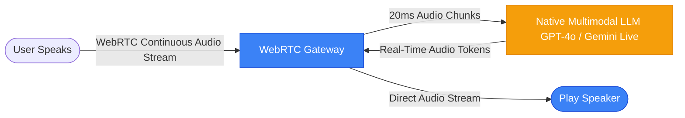

# Frontier Voice Architectures vs. Cascaded Systems

This document explores why frontier AI tools (like ChatGPT Advanced Voice Mode and Gemini Live) feel instantaneous and lifelike, what architectural pieces our application lacks, and how those systems overcome latency.

---

## 1. Cascaded Walkie-Talkie vs. Native Audio-to-Audio

### Our Current System (Cascaded Pipeline)
Our application uses a traditional **cascaded approach** where three separate systems are chained together in series:

* **Latency Source**: 
  1. **Pause Detection (STT)**: The browser must wait for 1.5–3 seconds of absolute silence to ensure the user has finished speaking before outputting the transcript text.
  2. **Handoffs**: Text is packaged, sent over HTTP, processed by Groq, formatted as JSON, sent back to the frontend, and requested again for TTS.
  3. **CPU Synthesis (TTS)**: Running neural speech synthesis (Kokoro) on CPU takes a significant amount of time before the first audio chunks are ready.

---

### Frontier Systems (Native Multimodal Audio)
ChatGPT (GPT-4o) and Gemini Live completely discard the STT and TTS steps. They do not convert voice to text internally.

* **How They Solve Latency**:
  1. **Audio-in, Audio-out**: The neural network directly accepts raw audio waveforms as inputs (tokenized as audio patches) and directly outputs audio waveforms. No text conversion occurs.
  2. **WebRTC Streaming**: They utilize WebRTC protocols (transceivers) to continuously stream audio chunks back and forth in **20ms increments** with ultra-low packet overhead.
  3. **Full-Duplex (Live Interruptions)**: Because the stream is continuous, if you speak while the model is talking, the transceiver detects your voice input instantly and interrupts the server-side synthesis, stopping the local speaker immediately.

---

## 2. Gap Matrix: What We are Missing

| Component | Our Cascaded Application | ChatGPT / Gemini Live | Latency Impact |
| :--- | :--- | :--- | :--- |
| **Model Handoff** | **Cascaded Chain**: Voice ➔ Text ➔ Reason ➔ Text ➔ Voice. | **Native Single Model**: Voice ➔ Reason ➔ Voice. | Saves ~3–5 seconds of conversion overhead. |
| **Connection Protocol** | Standard **HTTP REST APIs** (POST/GET). | **WebRTC / WebSocket Channels** (Bi-directional). | Saves ~1–2 seconds of connection setup and handshake. |
| **Input Chunking** | Waits for candidate to stop talking, then transcribes the entire block. | Sends raw voice data continuously in 20ms packets. | Saves ~2–3 seconds of silence timeout buffering. |
| **TTS Compute** | CPU-bound Docker container (slower synthesis). | Dedicated high-performance **GPU clusters** or local on-device hardware accelerators (NPU). | Saves ~4–8 seconds of CPU synthesis runtime. |
