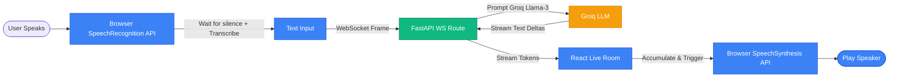

# Frontier Voice Architectures vs. Cascaded Systems

This document explores why frontier AI tools (like ChatGPT Advanced Voice Mode and Gemini Live) feel instantaneous and lifelike, what architectural pieces our application lacks, and how those systems overcome latency.

---

## 1. Cascaded Walkie-Talkie vs. Native Audio-to-Audio

### Our Current System (Native Browser SpeechSynthesis Pipeline)
Our application uses an optimized hybrid approach. Text generation is streamed from the cloud in real-time, while voice synthesis is handled entirely on the candidate's browser using native operating system speech engines:

* **Latency Source & Optimizations**: 
  1. **Pause Detection (STT)**: The browser still waits for a brief silence (1.0–2.0 seconds) to ensure the candidate has finished speaking before generating the transcript.
  2. **Zero-Latency Text Streaming**: The backend immediately streams text deltas down the WebSocket channel as Groq generates them, showing the question word-by-word instantly on screen.
  3. **Zero-Latency Voice Playback**: Synthesis runs natively inside the candidate's browser using local OS voices (0ms server compute/download latency).

---

### Frontier Systems (Native Multimodal Audio)
ChatGPT (GPT-4o) and Gemini Live completely discard the STT and TTS steps. They do not convert voice to text internally.

* **How They Solve Latency**:
  1. **Audio-in, Audio-out**: The neural network directly accepts raw audio waveforms as inputs (tokenized as audio patches) and directly outputs audio waveforms. No text conversion occurs.
  2. **WebRTC Streaming**: They utilize WebRTC protocols (transceivers) to continuously stream audio chunks back and forth in **20ms increments** with ultra-low packet overhead.
  3. **Full-Duplex (Live Interruptions)**: Because the stream is continuous, if you speak while the model is talking, the transceiver detects your voice input instantly and interrupts the server-side synthesis, stopping the local speaker immediately.

---

## 2. Gap Matrix: What We are Missing

| Component | Our Application | ChatGPT / Gemini Live | Latency Impact |
| :--- | :--- | :--- | :--- |
| **Model Handoff** | **Cascaded Chain**: Voice ➔ Text ➔ Reason ➔ Text ➔ Voice. | **Native Single Model**: Voice ➔ Reason ➔ Voice. | Saves ~3–5 seconds of conversion overhead. |
| **Connection Protocol** | Standard **WebSocket Channel** for text streaming. | **WebRTC Gateway** for continuous audio stream. | Saves ~1–2 seconds of text packaging and framing. |
| **Input Chunking** | Waits for candidate to stop talking, then transcribes the entire block. | Sends raw voice data continuously in 20ms packets. | Saves ~2–3 seconds of silence timeout buffering. |
| **TTS Compute** | Browser-local **SpeechSynthesis API** utilizing OS engines (instant). | Dedicated high-performance **GPU clusters** or local on-device hardware accelerators (NPU). | Saves server latency, matches direct audio streaming speed. |
