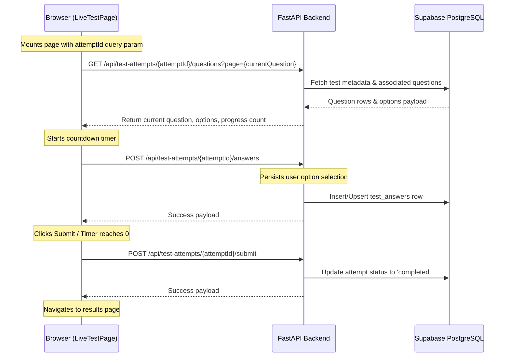

# Student Assessment Engines & Database Tooling

This document outlines the architecture, state flows, and implementation details for the student-facing **Company Recruitment Simulator** and the standard **Live Test Assessment Engine**, as well as the system's database schema utilities.

---

## 🏢 1. Company Recruitment Simulator (Student Workspace)

The Company Simulator (`CompanySimulationPage.tsx`) provides high-fidelity mock placement drives replicating the workflows of major IT recruiters. It features customized round types, timing rules, evaluation criteria, and API integrations.

### Recruiter Workflows

1. **Capgemini**
   - **Round 1: Game-Based Aptitude** (A cognitive memory grid game).
   - **Round 2: Pseudocode & Logic** (Algorithmic MCQs).
   - **Round 3: Timed Essay Writing** (Timed writing evaluation).
   - **Round 4 & 5: AI Technical & HR Verbal Interviews** (Real-time voice agent dialogue).
2. **TCS (Ninja/Digital)**
   - **Round 1: NQT Written Simulation** (Verbal, quantitative, and logical MCQs).
   - **Round 2 & 3: AI Technical & HR Verbal Interviews**.
3. **Accenture**
   - **Round 1: Cognitive & Technical MCQ** (MS Office suite, Cloud metrics, and logic).
   - **Round 2: Communication Assessment** (Simulated oral reading assessment).
   - **Round 3 & 4: AI Technical & HR Verbal Interviews**.
4. **Infosys**
   - **Round 1: Mathematical & Reasoning Puzzles** (Reasoning MCQs).
   - **Round 2: Pseudocode & Compiler Logic** (Dry-run tracing MCQs).
   - **Round 3 & 4: AI Technical & HR Verbal Interviews**.

---

### Technical Round Architectures

#### A. Game-Based Aptitude (Capgemini)
- **State Flow**: The player must reproduce a sequence of flashing tiles on a $3 \times 3$ grid.
- **Rules**: 
  - Iterates through 3 levels of increasing difficulty.
  - The length of the sequence is determined by `2 + roundNumber` (e.g. Level 1 flashes 3 tiles).
  - Tapping an incorrect grid cell triggers an immediate game over (`simStep = "result"`).
  - Successfully passing all 3 levels scores a full $100\%$.

#### B. Multiple Choice Question (MCQ) Rounds
- **Data Source**: Fetches from the backend endpoint `GET /api/company-simulation/questions?company_id={company_id}&round_type={round_type}`.
- **Local Fallback Pools**: If the backend is empty or fails, the frontend utilizes localized mock question lists (`PSEUDOCODE_QUESTIONS`, `TCS_NQT_QUESTIONS`, `ACCENTURE_COGNITIVE_QUESTIONS`, `INFOSYS_PUZZLE_QUESTIONS`).
- **Grading**: Answers are validated instantly. On submission, the correct answer is highlighted alongside a detailed markdown-formatted solution/explanation. The overall score is calculated as a percentage of total correct answers.

#### C. Timed Essay Writing
- **Mechanism**: Students write an essay on a tech topic (e.g. *The impact of Generative AI on student curriculum*).
- **Time Constraint**: Enforces a strict $3$-minute ($180$-second) timer. The system auto-submits once the timer hits $0$.
- **Heuristic Scoring Model**:
  - Base score: $30$ points.
  - Word count: $+30$ points if the text has $\ge 100$ words.
  - Structure: $+20$ points if it has paragraphs (contains newline character `\n`).
  - Volume: $+20$ points if total length is $>300$ characters.

#### D. Communication Assessment (Accenture)
- **Mechanism**: Evaluates speech reading patterns. The candidate is presented with a standard corporate reading passage and must record their voice reading it aloud.
- **Timing**: Enforces a $15$-second recording buffer.
- **Heuristics & Mock Feedback**: Returns a simulated transcription scoring matrix:
  - **Fluency**: $92\%$
  - **Pronunciation**: $88\%$
  - **Sentence Syntax**: $100\%$
  - **Overall Score**: $93\%$

#### E. AI Technical & HR Interviews
- **Execution**: Clicking "Simulate" triggers the backend endpoint `POST /api/ai-interviews`.
- **Payload**: Automatically structures a Job Description (`jd_text`) targeting the company's profile and starts the Live AI Interview Voice Room (`/ai-interview/live/{session_id}`).

---

## ⏱️ 2. Standard Timed Assessment (Live Test Engine)

The standard practice test engine (`LiveTestPage.tsx`) conducts structured, timed MCQ assessments mapped to specific subjects, topics, and subtopics.

### Operational Sequence

### Visual & Interactive Rules
- **Header Timer**: Counts down from the test's remaining duration. The text transitions to a red color warning under $5$ minutes ($300$ seconds) to signal urgency.
- **Side Panel Progress Grid**: Displays a grid of numbered squares indicating all questions. The color state mappings are:
  - **Emerald Green**: Answered questions.
  - **Amber Yellow**: Marked/flagged questions.
  - **White (Borders)**: Current active question.
  - **Gray/Transparent**: Unvisited questions.
- **Dynamic Help Cards**: Surfaces contextual references (e.g. *Calculator Hints*, *Quick Mathematical References*) tailored to the active topic.

---

## 🛠️ 3. Database Setup & Seeding Utilities

The project includes Python scripting utilities to set up, populate, and inspect the PostgreSQL/Supabase database tables locally or remotely.

### A. Seeding Script (`backend/supabase/seed_existing_schema.py`)
- **Purpose**: Connects directly to the PostgreSQL pooler (`DATABASE_URL`) to populate assessment schemas.
- **Action**:
  - Resolves foreign key UUID mapping for core subjects (`aptitude`, `reasoning`, `verbal`, `coding`) and topic slugs (`quantitative-aptitude`, `logical-reasoning`, `grammar`, `data-structures`).
  - Creates MCQ question profiles and links options dynamically.
  - Connects questions to their tests via `test_questions` and updates the count limits.
  - Uses transactional commit block for bulk inserts.

### B. Schema Inspector (`backend/supabase/inspect_schema.py`)
- **Purpose**: Diagnostic script to trace schema configuration differences, RLS policies, indices, and sizes.
- **Action**:
  - Connects to the database and fetches metadata from `information_schema.tables`, `information_schema.columns`, `pg_constraint`, `pg_indexes`, and `pg_policies`.
  - Performs row count aggregations on active tables.
  - Serializes database structure as a formatted JSON document.
